<h1 align="center">Manuel d'utilisation de l'application Mobistory</h1>
<h2 align="center">Développé par Marius DONNÉ et Thomas VELU</h2> 

<br>
<br>

<h3 align="center"> VERSION 1.1 </h3>

<div style="page-break-after: always;"></div>

<h1 align="center">SOMMAIRE</h1>

1. [Introduction](#introduction)  
    1. [Objectif](#objectif)  
	2. [Présentation de l'application](#présentation-de-lapplication)

2. [Fonctionnement général](#fonctionnement-général)
    1. [Page "Événements"](#page-événements)
    2. [Page "Détail d'un événement"](#page-détail-dun-événement)
    3. [Page "Favoris"](#page-favoris)
    4. [Page "Quizz"](#page-quizz)
    5. [Page "Paramètres"](#page-paramètres)

3. [Problèmes et améliorations](#problèmes-et-améliorations)

<div style="page-break-after: always;"></div>

# Introduction

## Objectif

```
Cette application a été développé dans le cadre d'un cours d'interface graphique par M. Michel CHILOWICZ. Le but de cette application est d'apprendre à des étudiants à l'ESIPE en deuxième année d'ingénierie en informatique l'utilisation de Jetpack Compose sous Android.

Ce manuel vise à aider l'utilisateur de l'application "Mobistory" afin qu'il puisse l'utiliser correctement et explorer toutes les fonctionnalités de l'application.
```

## Présentation de l'application

```
L'application "Mobistory" permet à l'utilisateur d'en apprendre plus sur l'histoire du monde grâce à des événements sélectionnés, ou à des quizz sur ses connaissances en histoire.
```

<div style="page-break-after: always;"></div>

# Fonctionnement général

```
L'application possède 4 pages principales.
```

## Page "Événements"

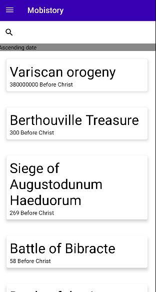

```
La page "Événements" affiche la liste de tous les événements enregistrés en base de données. Vous pouvez défiler cette liste.

Dans cette page, vous pouvez ouvrir le menu en appuyant sur l'icône en haut à gauche.
```


```
Avec l'appui de cette icône, un menu va s'afficher pour vous montrer les différentes pages disponibles de l'application.
```

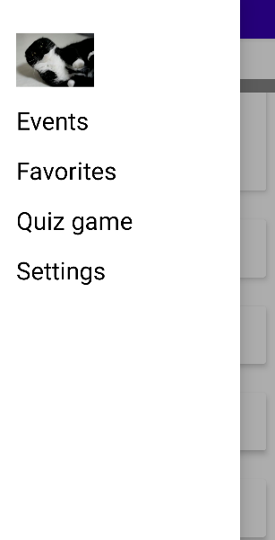

```
Vous pouvez chercher un événement particulier en écrivant son nom dans la barre de recherche.
```

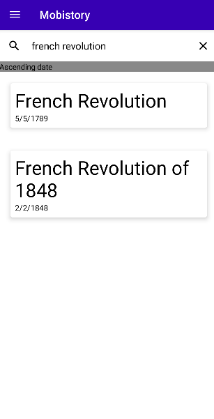

```
Vous pouvez aussi trier l'ordre des événements avec ce bouton.
```

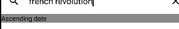

```
En cliquant le bouton au dessus.
```

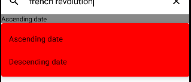

## Page "Détail d'un événement"

```
Vous pouvez aussi appuyer sur un événement dans la page "Événement" / "Favoris" pour ouvrir une page afin d'en savoir plus sur l'événement.

Par exemple :
```

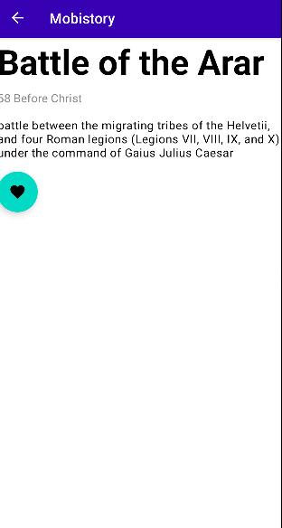

```
Avec la page de détail, il est possible de le rajouter aux événements favoris ou de le retirer s'il est déjà dans les favoris.
Pour cela, il faut appuyer sur le bouton en forme de coeur.
```

```
Un événement peut posséder des événements apparentés.
```

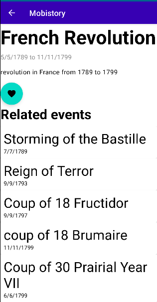

```
Ces événements sont cliquables et redirige sur un autre événement.
```

> Il est important de noter que chaque page autre que "Événements" possède une flèche "retour" à la place du menu.
Cette flèche permet de revenir en sur la page précédente.

## Page "Favoris"

```
Cette page répertorie tous les événements favoris.
```

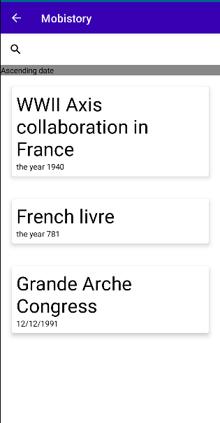

```
Comme la page "Événements, chaque événement est cliquable et permet d'obtenir des informations supplémentaires sur l'événement avec le choix de le retirer des favoris.
```

## Page "Quizz"

```
Cette page permet de jouer à un jeu sur vos connaissances historiques.
Le but du jeu est très simple :
    - En haut de l'écran, le nom d'un événement aléatoire ;
    - Quatre boutons avec des dates différentes sont proposés, un seul bouton est correct.
    - Si c'est la bonne réponse, vous gagnez dix points, sinon, vous perdez la partie.

Le jeu continue tant que vous ne perdrez pas.

Essayez de battre mon record (410 points) !
```

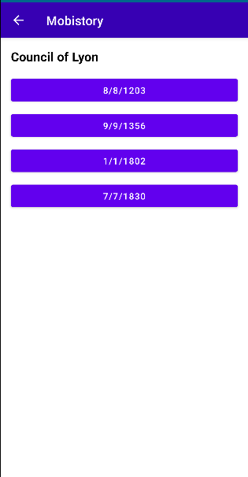
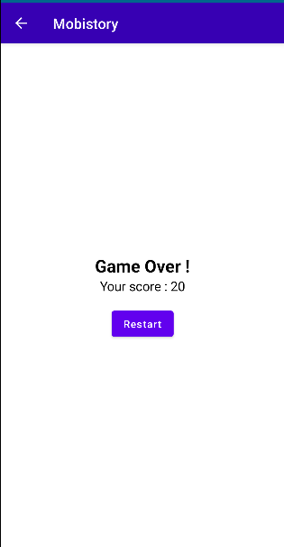

## Page "Paramètres"

```
Cette page permet de mettre à jour l'application ainsi que des données.
```

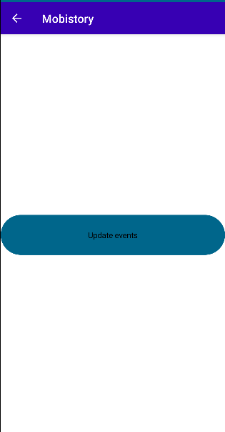


<div style="page-break-after: always;"></div>

# Problèmes et améliorations

```
L'application présente encore quelques bugs :
    - Le bouton "favori" ne se mettra pas à jour lors d'un clique de l'utilisateur ;
    - Lors de la visite d'un événement apparenté, si nous voulons retourner en arrière, le bouton retour reviendra directement sur la page "Événements" ;
    - Des problèmes d'affichage ;
    - etc.